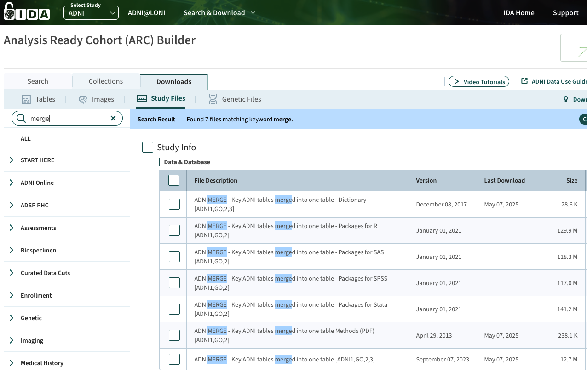

# Reproducible codes for BEBMS

This repository contains codes for the ML4H (2025) submission of [*Bayesian Event-Based Model for Disease Subtype and Stage Inference*](https://arxiv.org/pdf/2512.03467).

Note that the data generation and experiments are conducted on a high-performance computing platform (CHTC at the University of Wisconsin--Madison) due to the large number of jobs to run. You can, however, modify relevant files to run on personal computers.

Many plots of our paper are available on Observable: [@hongtaoh/subtypes-results](https://observablehq.com/@hongtaoh/subtypes-results).

## Cite this paper

```
@inproceedings{Hao2025bayesian,
  author    = {Hongtao Hao and Joseph L. Austerweil},
  title     = {Bayesian Event-Based Model for Disease Subtype and Stage Inference},
  booktitle = {Proceedings of the 5th Machine Learning for Health Symposium},
  volume    = {297},
  pages     = {??--??}, % Page numbers are not provided now, will add later. 
  year      = {2025},
  publisher = {PMLR},
}
```

## Installation and Setup

```sh
pip install bebms
```

Please refer to [https://github.com/hongtaoh/bebms_pkg](https://github.com/hongtaoh/bebms_pkg) for more information about the package. 

## High dimensional data

Within the folder of [`high_dimensional`](high_dimensional/), you can find:

- `high_dimensional.json`: the theta/phi parameters for the 100 synthetic biomarkers generated by ChatGPT. 
- `data` folder: the five datasets generated using `bebms` based on `high_dimensional.json`. 
- `bebms_results` folder: the results of running `bebms` on the five datasets. 


## How to generate synthetic data?

### Obtain theta/phi values of 12 biomarkers

`adni_params_ucl_gmm.json` are the results of running the GMM algorithm of https://github.com/ucl-pond/kde_ebm on the [ADNI](https://adni.loni.usc.edu/) data. We ran this algorithm because it was developed by the same authors of SuStaIn, the baseline we are benchmarking against.

The parameter results are obtained by running `python3 get_adni_params.py`, which is based upon `utils_adni.py`.

`utils_adni.py` contains the implementations for the descriptions about processing ADNI data in Section 4 of our manuscript.

**Please note that in this procedure, `adni.csv` will be generated and that is the real-world ADNI dataset.**

### How to get raw ADNI data?

In `get_adni_params.py`, you can see you need `ADNIMERGE.csv`. You can get it by [apply for data access through ADNI](https://adni.loni.usc.edu/data-samples/adni-data/#AccessData). They process requests within one week.

After you are granted the access, log in [https://ida.loni.usc.edu/login.jsp](https://ida.loni.usc.edu/login.jsp). Then go to [https://ida.loni.usc.edu/home/projectPage.jsp?project=ADNI](https://ida.loni.usc.edu/home/projectPage.jsp?project=ADNI). Click "Search & Download". In the dropdown menu, click "Study Files".

You'll see "Analysis Ready Cohort (ARC) Builder". In the search box, type "merge".



Download the following two files:

- ADNIMERGE-Key ADNI tables merged into one table [ADNI1,GO,2,3]

- ADNIMERGE-Key ADNI tables merged into one table - Dictionary [ADNI1,GO,2,3]


### Generate synthetic data

Related files are `gen.sh` and `gen.py`.

To generate synthetic data, run `bash gen.sh`. The resulting folder and files will be

- `data` folder which contains the raw data in `csv` format.
- `true_order_and_stages.json`, which contains the true progression and disease stages for model evaluations.

### Hyper-parameters

Some of the most important hyper-parameters we mentioned in Section 4:

- 1-5 subtypes
- 12 biomarkers from adni.
- at least 10 progressing participants for each subtype. 
- The number of participants for each subtype is decided using dirichlet-multinomial. dirichlet prior is randomly chosen from [0.1, 2, 5, 20].
- mallows sampling temperature is uniformly sampled from [0.01, 0.5].

For more parameters, see `config.yaml`.

Note that we made a mistake in our manuscript:

## How to run synthetic experiments

Related files are `run_mlhc.py`, `run_mlhc.sh`, and `run_mlhc.sub`.

Run `bash run.sh` to run the experiments. All results will be saved to the folder of [`algo_results`](/algo_results).

## How to analyze synthetic data results

Run `python3 save_csv.py`. You'll get all the results as `all_results.csv`.

For data analysis and visualizations, we used Observable. Since we cannot anonymize the notebooks, we are not able to share the codes at this point for the reviewing purpose.

## How to analyze the real-world ADNI results

Related files are in the folder of `experimental_notebooks`.

- `notebooks/2025-09-06-adni-bebms.ipynb`: Running Bebms on ADNI.
- `notebooks/2025-09-06-adni-sustain-ordering.ipynb`: Running SuStaIn on ADNI.
- `notebooks/2025-09-06-bebms-cv.ipynb`: Cross validation of BebmS.
- `notebooks/2025-09-06-sustain-adni-cv.ipynb`: Cross validation of SuStaIn.

## Other files

- `gen_combo.py`: to generate filenames to be used in all `sh` files. The results will be `all_combinations.txt`. We also have `test_combinations.txt` for testing purposes.
- `failed_files.txt`, `missing_files.txt`, `na_combinations.txt` are the diagnostic files after running `python3 save_csv.py`.
- `cleanup.sh`: SuStaIn will result in many pickle files. We use this script to delete all of the unnecessary files.
- `notebooks/2025-11-06-plot-distributions.ipynb` plotted the "Theoretical and Empirical Biomarker Distributions".
- `notebooks/2025-11-08-additional-plots.ipynb` plotted the distribution of relative error in estimating optimal subtype count, and the distribution of Kendall's $W$. 